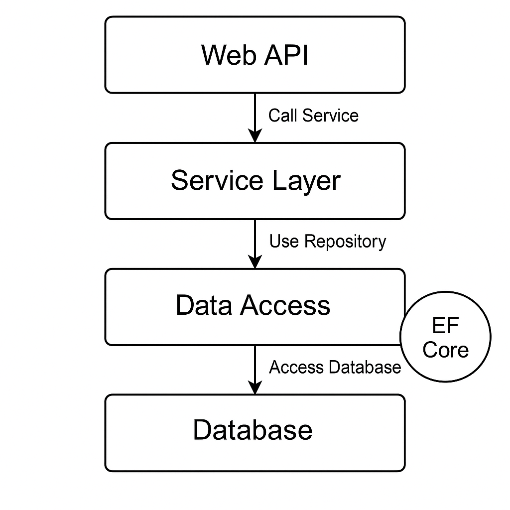

# Advanced C# Repository Pattern

[](https://github.com/PriyankaManePatil/advanced-csharp-repository-pattern/actions/workflows/dotnet.yml)

A comprehensive **.NET 10 LTS educational reference** for Repository Pattern and layered architecture. It demonstrates aggregate-specific and generic repositories, read/write segregation, specifications, Unit of Work, decorators, caching, test doubles, Minimal APIs, automated tests and CI.

> This project uses EF Core's in-memory provider for learning and architectural demonstration. Use a durable database provider and production security/observability controls for a real deployment.

## Architecture

```text
WebApi -> Application -> Core
   |                       ^
   +----> Infrastructure --+
```

- **Core**: domain entities and persistence abstractions
- **Application**: DTOs, validation and use-case orchestration
- **Infrastructure**: EF Core context and repository implementation
- **WebApi**: Minimal API endpoints, dependency injection, first-party OpenAPI and exception handling
- **UnitTests**: isolated application service tests
- **IntegrationTests**: repository and HTTP endpoint tests



## Technology

- .NET 10 LTS
- ASP.NET Core Minimal APIs
- Entity Framework Core In-Memory
- EF Core 10.0.11 and ASP.NET Core OpenAPI
- xUnit, Moq and WebApplicationFactory
- Coverlet code coverage
- GitHub Actions

## Run locally

Install the [.NET 10 SDK](https://dotnet.microsoft.com/download/dotnet/10.0), then run:

```bash
dotnet restore AdvancedRepositoryPattern.sln
dotnet build AdvancedRepositoryPattern.sln
dotnet run --project src/WebApi/WebApi.csproj
```

In Development, the OpenAPI document is available at `http://localhost:<port>/openapi/v1.json`.

## Learning documentation

The detailed learning path is in [`docs/README.md`](docs/README.md). It includes fundamentals, a repository-variant catalogue, a class-by-class walkthrough, decision tables, testing guidance and anti-patterns.

Implemented examples include:

- Aggregate-specific and generic repositories
- Read-only and read/write-segregated contracts
- Specification pattern
- Unit of Work
- Logging and caching decorators
- In-memory test-double repository
- Guidance for direct EF Core, Dapper, CQRS, event sourcing and composite repositories

## API

| Method | Route | Result |
|---|---|---|
| GET | `/api/products` | All products |
| GET | `/api/products/{id}` | Product or `404` |
| POST | `/api/products` | Created product and `201` |
| PUT | `/api/products/{id}` | `204` or `404` |
| DELETE | `/api/products/{id}` | `204` or `404` |
| GET | `/health` | Application health |

Example request:

```json
{
  "name": "Mechanical Keyboard",
  "price": 99.50
}
```

## Test and coverage

```bash
dotnet test AdvancedRepositoryPattern.sln --collect:"XPlat Code Coverage" --results-directory TestResults
```

Tests cover service validation, CRUD repository behaviour, missing records and HTTP CRUD status codes. CI executes restore, build and tests for every pull request and push to `main`.

## Design decisions

- Read queries use `AsNoTracking`.
- Repository operations accept cancellation tokens.
- Repository writes stage changes; Unit of Work commits successful business operations once.
- Update and delete return `bool` to represent not-found results without exceptions.
- API contracts use DTOs rather than exposing EF Core entities.
- Standard `ILogger<T>` is preferred over a custom logging wrapper.
- An in-memory provider keeps the sample self-contained; it does not reproduce every relational-database behaviour.

## License

Licensed under the MIT License.
