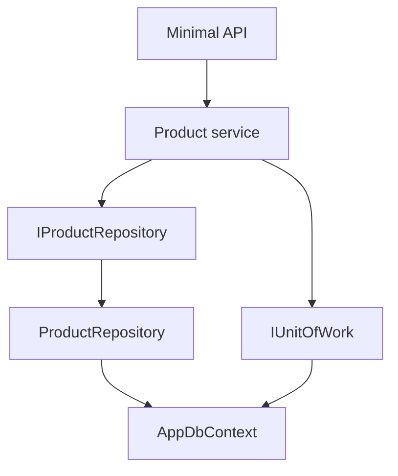

# 1. Repository Pattern Fundamentals

## Definition

A repository presents a collection-like interface for loading and persisting domain entities. It places a
boundary between application/domain code and persistence technology. Application code asks for products;
it does not compose EF Core queries, open SQL connections or know table names.

## What it solves

- Keeps persistence details out of use cases.
- Gives aggregate queries domain names.
- Supports dependency inversion and focused tests.
- Creates one place for query rules such as no-tracking and specifications.

## What it does not solve

- It does not remove the need for database integration tests.
- It does not automatically improve an application that only wraps every `DbSet` method.
- It is not an ORM replacement; EF Core already implements repository and Unit of Work mechanics.
- It does not mean every table needs a repository.

## Request and transaction flow

Reads are no-tracking queries. Writes are staged by the repository and committed once by the Unit of Work.
This prevents one business operation from being partially saved when it uses several repositories.

## Repository boundary

Repositories should normally be created per aggregate root, not per database table. An aggregate-specific
contract can inherit reusable generic operations while adding domain language such as
`GetByPriceRangeAsync`. DTO mapping and request validation belong in the application layer.
