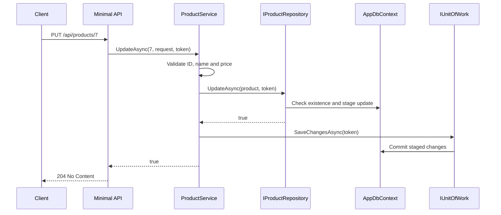

# 10. End-to-End Request Lifecycle

This walkthrough traces `PUT /api/products/7` with a valid request.

## Step-by-step

1. **ASP.NET Core routing** matches the integer route and supplies a request cancellation token.
2. **Minimal API** delegates to `IProductService`; it does not know EF Core.
3. **ProductService** validates the ID, trims the name and rejects a negative price.
4. **IProductRepository** keeps the service independent of the persistence implementation.
5. **ProductRepository/EfRepository** checks existence and marks the entity as updated.
6. **IUnitOfWork** commits once only when the update was staged successfully.
7. **Minimal API** converts `true` to `204`; a missing product becomes `404`.
8. **GlobalExceptionHandler** converts unexpected or invalid exceptions into Problem Details.

## Failure paths

| Failure | Where detected | Result |
|---|---|---|
| ID is zero/negative | Application service | `400 Bad Request` through exception handler |
| Blank name | Application service | `400 Bad Request` |
| Negative price | Application service | `400 Bad Request` |
| Product missing | Repository returns `false` | `404 Not Found`; Unit of Work is not called |
| Unexpected database failure | Infrastructure throws | Logged `500` Problem Details response |
| Client disconnects | Cancellation token | Cooperative cancellation reaches EF Core |
